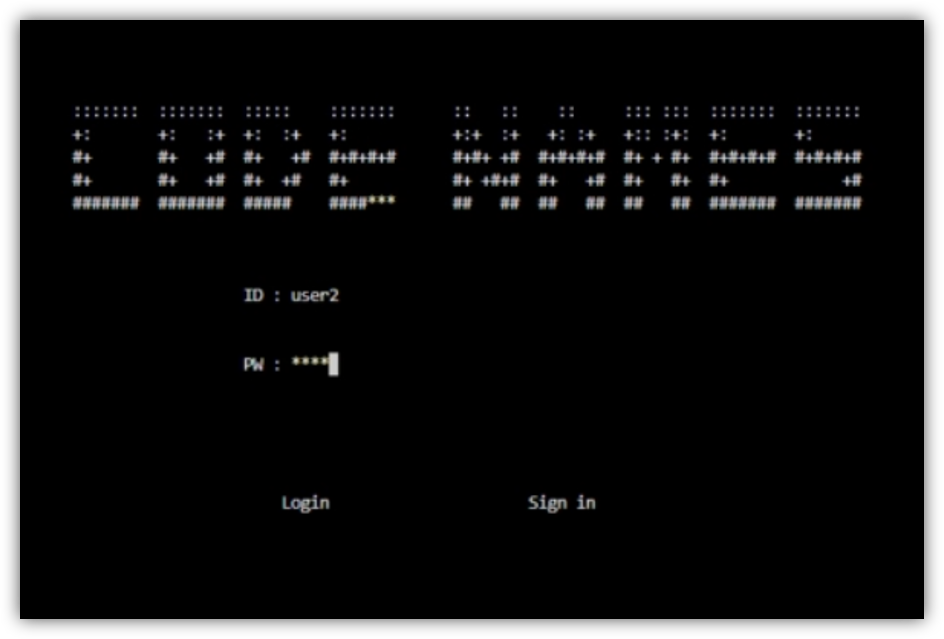
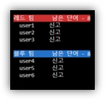

<a id="readme-top"></a>
# 코드네임즈(CODENAMES)


## 목차 (Table of Contents)

1. [프로젝트 소개 (About The Project)](#프로젝트-소개-about-the-project)
2. [환경 준비 (Prerequisites)](#환경-준비-prerequisites)
3. [서버측 인증서 생성 (Server-side Certificate Creation)](#서버측-인증서-생성-server-side-certificate-creation)
4. [클라이언트 인증서 준비 (Client Certificate Setup)](#클라이언트-인증서-준비-client-certificate-setup)
5. [실행 방법 (How to Run)](#실행-방법-how-to-run)
6. [플레이 방법 (How To Play)](#플레이-방법-how-to-play)
7. [저자 (Author)](#저자-author)

## 프로젝트 소개 (About The Project)
보드게임 CODENAMES를 온라인으로 플레이할 수 있도록 구현하였습니다. 팀장은 주어진 정보를 바탕으로 힌트를 주고, 팀원들은 힌트를 바탕으로 정답을 추론해 보세요.


## 환경 준비 (Prerequisites)

서버 및 클라이언트 개발에 필요한 라이브러리를 설치하세요.

```bash
sudo apt update
sudo apt install libsqlite3-dev  # SQLite 동작에 필요
sudo apt install libssl-dev      # OpenSSL 개발 라이브러리
```

## 서버측 인증서 생성 (Server-side Certificate Creation)

⚠️ **아래 과정은 반드시 `server/` 폴더에서 진행해야 합니다.**

### 자체 CA 인증서 만들기 (Create CA Certificate)

#### 📌 CA 개인키 생성

```bash
openssl genpkey -algorithm RSA -out ca.key -aes256
```

#### 📌 CA 인증서 생성

```bash
openssl req -x509 -new -nodes -key ca.key -sha256 -days 3650 -out ca.crt
```

### 서버 인증서 만들기 (Create Server Certificate)

#### 📌 서버 개인키 생성

```bash
openssl genpkey -algorithm RSA -out server.key
```

#### 📌 서버 인증서 서명 요청 (CSR) 생성

```bash
openssl req -new -key server.key -out server.csr
```

#### 📌 CA로 서버 인증서 서명

```bash
openssl x509 -req -in server.csr -CA ca.crt -CAkey ca.key -CAcreateserial -out server.crt -days 3650 -sha256
```

## 클라이언트 인증서 준비 (Client Certificate Setup)

서버에서 생성한 `ca.crt` 파일을 클라이언트 폴더에 복사합니다.

```bash
cp server/ca.crt client/
```

클라이언트는 이 인증서를 통해 서버의 인증서를 검증합니다.

## 실행 방법 (How to Run)

### 서버 실행 (Server Execution)

서버 디렉토리로 이동 후 서버를 빌드하고 실행합니다.

```bash
cd server
make
./server
```

### 클라이언트 실행 (Client Execution)

클라이언트 디렉토리로 이동 후 클라이언트를 빌드하고 실행합니다.

```bash
cd client
make
./client
```

<p align="right">(<a href="#readme-top">back to top</a>)</p>

## 플레이 방법 (How To Play)

### 회원가입/로그인 (Sign Up/Login)

처음이라면 회원가입(sign in)을 통해 계정을 생성하고, 계정이 이미 있다면 로그인을 해주세요.</p>


### 게임 시작 (Start Game)

[랜덤 매칭 시작] 버튼을 눌러 게임을 시작해 주세요.</p>

### 게임 진행 (Game Progress)

#### 게임의 흐름 (Game Flow)

게임이 시작되면 바닥에 단어와 종류가 정해진 카드가 25개 깔리고 역할과 팀(빨간 팀, 파란 팀)이 배정됩니다. </p>
[빨간팀 팀장] -> [빨간 팀 팀원] -> [파란 팀 팀장] -> [파란 팀 팀원] -> [빨간 팀 팀장] -> .... </p>위와 같은 순서로 차례가 진행이 되며 목표점수(빨간 팀: 9점, 파란 팀: 8점)를 얻거나 암살자 카드를 고르는 순간 게임이 종료됩니다.

#### 역할 배정 (Role Assignment)

게임이 시작되면 유저 각각에게 역할이 배정됩니다. 역할별로 할 수 있는 일은 다음과 같습니다.

1. [팀장] : 단어뿐만 아니라 카드의 색을 모두 볼 수 있습니다. 팀장의 턴이 되면 카드의 색과 단어를 바탕으로 <단어, 숫자>의 형식으로 팀원에게 힌트를 지급할 수 있습니다.
2. [팀원] : 팀장이 준 힌트를 바탕으로 카드를 선택하여 정답을 맞출 수 있습니다. 카드를 선택했을 때 카드의 종류에 따라 아래의 이벤트가 발생하며, 최대로 맞출 수 있는 횟수는 팀장이 불러준 숫자의 +1만큼입니다.
    * [빨강 카드]: 빨간 팀이 점수를 획득하며 자신이 빨간 팀일 때 정답을 맞출 수 있는 횟수가 남아있다면 추가로 정답을 맞힐 수 있습니다.  
    * [파랑 카드]: 파란 팀이 점수를 획득하며 자신이 파란 팀일 때 정답을 맞출 수 있는 횟수가 남아있다면 추가로 정답을 맞힐 수 있습니다.  
    * [일반 카드]: 점수를 얻지 않으며, 차례가 넘어갑니다.
    * [암살자 카드]: 선택하게 되면 게임이 종료되며, 선택한 팀이 패배합니다.

#### 신고 (Report)

부적절한 플레이를 하는 플레이어가 있다면 Ctrl+A를 누르고 유저를 선택해 신고가 가능합니다.</p>


### 데모 플레이 (Demo Play)

[Demo Video](https://www.youtube.com/watch?v=eX-OVSaTG-Y)

## 저자 (Author)
- **[장보원]**
- **[현지혜]**
- **[한승준]**

<p align="right">(<a href="#readme-top">back to top</a>)</p>
